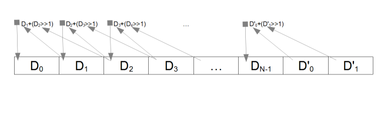

# FibonacciRng

This gem implements a random number generator inspired by the famous Fibonacci
number sequence. To be specific, it is a normalized, cyclic Fibonacci pseudo
random number generator. So far, this generator has performed quite well when
compared to the built-in Ruby random number generator when tested with:

* A chi-squared test
* An auto-correlation test
* An X/Y scatter graph test

At this time I lack the mathematical skill to go beyond these rudimentary
measures but they are enough to qualify this code for "light" duties.

Proving that this is indeed a good (or poor) RNG is left as an exercise for
the reader! Hopefully one with greater knowledge of statistics than I.

## Installation

Add this line to your application's Gemfile:

    gem 'fibonacci_rng'

And then execute:

    $ bundle

Or install it yourself as:

    $ gem install fibonacci_rng

The fibonacci_rng gem itself is found at: ( https://rubygems.org/gems/fibonacci_rng )

A C++ version of this generator also exists and may be found at
( https://github.com/PeterCamilleri/Fibonacci_CPP )


## Usage

```ruby
require 'fibonacci_rng'
```

Then in an appropriate place in the code:

```ruby
@my_rng = FibonacciRng.new(depth, seed_value)
```

Where depth is an optional integer value between 2 and 256 and the seed value
is a number or string or other object that has a repeatable value. You can
also get a "random" generator of the default depth (8) and a randomized
seed. Here is an overview of the available options.

```ruby
#Method #1
@my_rng = FibonacciRng.new                            # Random seed, depth = 8

#Method #2
@my_rng = FibonacciRng.new(seed)                      # Specified seed, depth = 8

#Method #3
@my_rng = FibonacciRng.new(seed, 12)                  # Specified seed, depth = 12

#Method #4
@my_rng = FibonacciRng.new(FibonacciRng.new_seed, 12) # Random seed, depth = 12

```
In addition, keyword arguments are emulated (as of Version 0.4.0) so these
additional options also are available:

```ruby
#Method #5
@my_rng = FibonacciRng.new(seed: seed)                # Specified seed, depth = 8

#Method #6
@my_rng = FibonacciRng.new(seed: seed, depth: 12)     # Specified seed, depth = 12

#Method #7
@my_rng = FibonacciRng.new(depth: 12)                 # Random seed, depth = 12
```
Note: Mixing positional and keyword arguments will not, in general, work.

#### Generating Pseudo Random Data

The Fibonacci generator class supports the classical rand method that emulates
the behavior of the standard generator. It works like this:

```ruby
@my_rng.rand          # A "random" float between 0.0 and less than 1.
@my_rng.rand(0)       # A "random" float between 0.0 and less than 1.
@my_rng.rand(100)     # A "random" integer between 0 and 99
@my_rng.rand(1..6)    # A "random" integer between 1 and 6
```

In addition, here are some other options:

```ruby
@my_rng.dice(100)     # A "random" integer between 0 and 99
@my_rng.byte          # A "random" integer between 0 and 255
@my_rng.word          # A "random" integer between 0 and 65535
@my_rng.float         # A "random" float between 0 and less than 1.
@my_rng.string(10)    # A "random" string of 10 characters in length.

# A "random" string of 10 characters in length from the string 'abcdefg'.
@my_rng.string(10, 'abcdefg')
```

and also available are these helpful methods:

```ruby
@my_rng.reseed(value) # Reseed the sequence with the new value.
@my_rng.reseed        # Reseed the sequence with a "random" seed.
@my_rng.spin(count)   # Spin the generator count times.
@my_rng.spin          # Spin the generator once.
```

If more than one stream of numbers is required, it is best to use multiple
instances of FibonacciRng objects rather than rely on one. This will help avoid
the two streams of data being correlated.

#### Hashing

As more as an experiment than anything else, it is also possible to use
the generator as a primitive hash generator. To do so, create a new
generator with a salt value, append data to it, and the retrieve the results
as a (big) number or a string.

```ruby
fib = FibonacciRng.new('salt')
fib << "The quick brown fox jumps over the lazy dog."
puts fib.hash_string
#displays: j5jqhk7ntrze02icv38gj28efa2qrctr6mi5ejbr2p4nj
```
Note that the length of the hash string is a function of the depth of the
generator used to create it. This is about 5.5 characters per unit of depth.

#### Salting

Another (more practical) use for the Fibonacci generator is the creation of
salting strings for use in more capable hashing schemes. Here are four possible
ways that this can be done:

```ruby
#Method #1
salt_string = FibonacciRng.new.hash_string  #Thread safe.

#Method #2
salt_string = FibonacciRng.new(depth: 12).hash_string  #Thread safe.

#Method #3
Thread.current[:salter] = FibonacciRng.new   #Need a separate generator for each thread.
# Much intervening code omitted.
salter = Thread.current[:salter]
salter << Time.now.to_s  # Note that unique time values are NOT needed.
salt_string = salter.hash_string

#Method #4
Thread.current[:salter] = FibonacciRng.new   #Need a separate generator for each thread.
# Much intervening code omitted.
salter = Thread.current[:salter]
salter.spin
salt_string = salter.hash_string
```

Each time any of these is run, a different salt string will be generated.

#### Methods back in Good Standing

* bytes - This method would seem to generate an array of random bytes. It does
not. However, it doesn't matter either. The bytes method was added to improve
interoperability with the standard Random class. Thus deprecating it was a
mistake. This note serves to announce that the bytes method is not going away.
The source code will say it is deprecated until the next code update, but that
comment is in error.

## Theory of Operation

The random number generator used in this gem is based on a modified, cyclic
Fibonacci generator. This ring buffer design modifies the simple sequence so
that it feeds back onto itself, which in turn gives the appearance of chaos.
There is one further required modification however. Since the Fibonacci sequence
uses additions, a mechanism for preventing zeros from "swamping" the data, is
needed. This is accomplished by rotating one of the arguments to the right by
one bit. The basic outline of the generational cycle operation, with depth of
N is shown below:

<br>Notes:
* The last two elements are copies of the first two elements before
the array was transformed.
* Not shown above for brevity, the result of each addition is masked with the
value 0x1FFFFFFF before being stored. This masks off any data beyond the low
29 bits.

#### 29 bit Integers?

The random number generator masks the data in the ring buffer to 29 bit,
unsigned values. To understand this, it is first necessary to under why
masking is needed at all, and secondly, why this was done at 29 bits.

Masking at some level is required because it is needed to simulate the numeric
overflow of more primitive systems of arithmetic. In most systems, when the
limit of an integer is reached, overflow occurs with no error indication. Ruby
does not permit this to occur. To avoid overflow, Ruby transparently converts
from a simple integer (FIXNUM class) to a multiple-precision number
(BIGNUM class). The random number generator *requires* the computations to
overflow, so masking the results forces the computation to act as if they had.

So why 29 bits? Why not 32? or 64? The issue here is performance. Arithmetic
with BIGNUM values is much slower than with FIXNUM values. Further, the
conversion between FIXNUM and BIGNUM is also slow. The 29 bit size was
chosen to ensure that all computations remain with FIXNUM values without
ever reaching the threshold for the switch to BIGNUM values. In 32 bit Ruby
systems, 29 bits is the largest value that meets this requirement.

#### Code

Enough with all these words and pictures. The best way to gain insight into
ruby code is to study ruby code! What follows is the critical snippet of code
that makes this random number generator spin:

```ruby
private

#Cycle through the PRNG once.
def do_spin
  @buffer[-2] = @buffer[0]
  @buffer[-1] = @buffer[1]

  (0...@depth).each do |idx|
    tmp = @buffer[idx+2]
    @buffer[idx] = (@buffer[idx+1] + ((tmp >> 1)|(tmp.odd? ? TOP : 0))) & CHOP
  end
end

```
The above is found in the spinner.rb file. For completeness of understanding,
the following constants are defined in the fibonacci_rng.rb file:

```ruby
CHOP = 0x1FFFFFFF
TOP  = 0x10000000

```

## Contributing

Creating a good pseudo random number generator is quite an undertaking. For
this reason, any input is most welcomed. There are two basic plans by which
this can be accomplished.

#### Plan A

1. Fork it ( https://github.com/PeterCamilleri/fibonacci_rng/fork )
2. Create your feature branch (`git checkout -b my-new-feature`)
3. Commit your changes (`git commit -am 'Add some feature'`)
4. Push to the branch (`git push origin my-new-feature`)
5. Create new Pull Request

#### Plan B

Go to the GitHub repository and raise an issue calling attention to some
aspect that could use some TLC or a suggestion or an idea.
