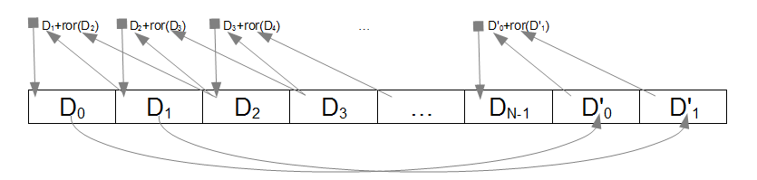

# FibonacciRng

This gem implements a random number generator inspired by the famous Fibonacci
number sequence. So far, this generator has performed quite well when compared
to the built-in Ruby random number generator when tested with:

* A chi-squared test
* An auto-correlation test
* An X/Y scatter graph test

At this time I lack the mathematical skill to go beyond these rudimentary
measures but they are enough to qualify this code for "light" duties.

Proving that this is indeed a good (or poor) RNG is left as an exercise for
the reader! Hopefully one with greater knowledge of statistics than I.

## Installation

Add this line to your application's Gemfile:

    gem 'fibonacci_rng'

And then execute:

    $ bundle

Or install it yourself as:

    $ gem install fibonacci_rng

## Usage

```ruby
require 'fibonacci_rng'
```

Then in an appropriate place in the code:

```ruby
@my_rng = FibonacciRng.new(depth, seed_value)
```

Where depth is an optional integer value between 2 and 99 and the seed value
is a number or string or other object that has a repeatable value. You can
also get a "random" generator of the default depth (8) and a randomized
seed. Here is an overview of the available options.

```ruby
#Method #1
@my_rng = FibonacciRng.new                            # Random seed, depth = 8

#Method #2
@my_rng = FibonacciRng.new(seed)                      # Specified seed, depth = 8

#Method #3
@my_rng = FibonacciRng.new(seed, 12)                  # Specified seed, depth = 12

#Method #4
@my_rng = FibonacciRng.new(FibonacciRng.new_seed, 12) # Random seed, depth = 12

```
In addition, keyword arguments are emulated (as of Version 0.4.0) so these
additional options also are available:

```ruby
#Method #5
@my_rng = FibonacciRng.new(seed: seed)                # Specified seed, depth = 8

#Method #6
@my_rng = FibonacciRng.new(seed: seed, depth: 12)     # Specified seed, depth = 12

#Method #7
@my_rng = FibonacciRng.new(depth: 12)                 # Random seed, depth = 12
```
Note: Mixing positional and keyword arguments will not, in general, work.

#### Generating Pseudo Random Data

The Fibonacci generator class supports the classical rand method that emulates
the behavior of the standard generator. It works like this:

```ruby
@my_rng.rand          # A "random" float between 0.0 and less than 1.
@my_rng.rand(0)       # A "random" float between 0.0 and less than 1.
@my_rng.rand(100)     # A "random" integer between 0 and 99
@my_rng.rand(1..6)    # A "random" integer between 1 and 6
```

In addition, here are some other options:

```ruby
@my_rng.dice(100)     # A "random" integer between 0 and 99
@my_rng.byte          # A "random" integer between 0 and 255
@my_rng.word          # A "random" integer between 0 and 65535
@my_rng.float         # A "random" float between 0 and less than 1.
@my_rng.string(10)    # A "random" string of 10 characters in length.

# A "random" string of 10 characters in length from the string 'abcdefg'.
@my_rng.string(10, 'abcdefg')
```

and also available are these helpful methods:

```ruby
@my_rng.reseed(value) # Reseed the sequence with the new value.
@my_rng.reseed        # Reseed the sequence with a "random" seed.
@my_rng.spin(count)   # Spin the generator count times.
@my_rng.spin          # Spin the generator once.
```

If more than one stream of numbers is required, it is best to use multiple
instances of FibonacciRng objects rather than rely on one. This will help avoid
the two streams of data being correlated.

#### Hashing

As more as an experiment than anything else, it is also possible to use
the generator as a primitive hash generator. To do so, create a new
generator with a salt value, append data to it, and the retrieve the results
as a (big) number or a string.

```ruby
fib = FibonacciRng.new('salt')
fib << "The quick brown fox jumps over the lazy dog."
puts fib.hash_string
#displays: j5jqhk7ntrze02icv38gj28efa2qrctr6mi5ejbr2p4nj
```
Note that the length of the hash string is a function of the depth of the
generator used to create it. This is about 5.5 characters per unit of depth.

#### Salting

Another (more practical) use for the Fibonacci generator is the creation of
salting strings for use in more capable hashing schemes. Here are four possible
ways that this can be done:

```ruby
#Method #1
salt_string = FibonacciRng.new.hash_string  #Thread safe.

#Method #2
salt_string = FibonacciRng.new(depth: 12).hash_string  #Thread safe.

#Method #3
Thread.current[:salter] = FibonacciRng.new   #Need a separate generator for each thread.
# Much intervening code omitted.
salter = Thread.current[:salter]
salter << Time.now.to_s  # Note that unique time values are NOT needed.
salt_string = salter.hash_string

#Method #4
Thread.current[:salter] = FibonacciRng.new   #Need a separate generator for each thread.
# Much intervening code omitted.
salter = Thread.current[:salter]
salter.spin
salt_string = salter.hash_string
```

Each time any of these is run, a different salt string will be generated.

#### Deprecated Methods

* bytes - This method would seem to generate an array of random bytes. It does
not. That's why it's deprecated. Instead it generates a string with random
byte code values. Plays havoc with encodings too. To get an array of len random
byte values, try this example:

```ruby
generator = FibonacciRng.new
random_bytes = Array.new(len) { generator.byte }
```

## Theory of Operation

The random number generator used in this gem is based on a modified, cyclic
Fibonacci generator. This ring buffer design modifies the simple sequence so
that it feeds back onto itself, which in turn gives the appearance of chaos.
There is one further required modification however. Since the Fibonacci sequence
uses additions, a mechanism for preventing zeros from "swamping" the data, is
needed. This is accomplished by shifting one of the arguments to the right by
one bit. The basic outline of the generational cycle operation, with depth of
N is shown below:

<br>Note that the last two elements are copies of the first two elements before
the array was transformed.

## Contributing

1. Fork it
2. Create your feature branch (`git checkout -b my-new-feature`)
3. Commit your changes (`git commit -am 'Add some feature'`)
4. Push to the branch (`git push origin my-new-feature`)
5. Create new Pull Request

#### Plan B

Go to the GitHub repository and raise an issue calling attention to some
aspect that could use some TLC or a suggestion or an idea. Apply labels
to the issue that match the point you are trying to make. Then follow
your issue and keep up-to-date as it is worked on. All input are greatly
appreciated.